# DecodeLabs-Internship
Data Analyst Internship Project at DecodeLabs. This repository showcases data cleaning, preprocessing, analysis, and visualization techniques applied to real-world datasets. The project focuses on extracting actionable insights and supporting data-driven decision-making through analytical methods and reporting.

# DecodeLabs Data Analyst Internship Project

## Project 1: Data Cleaning & Visualization

### Dashboard 1
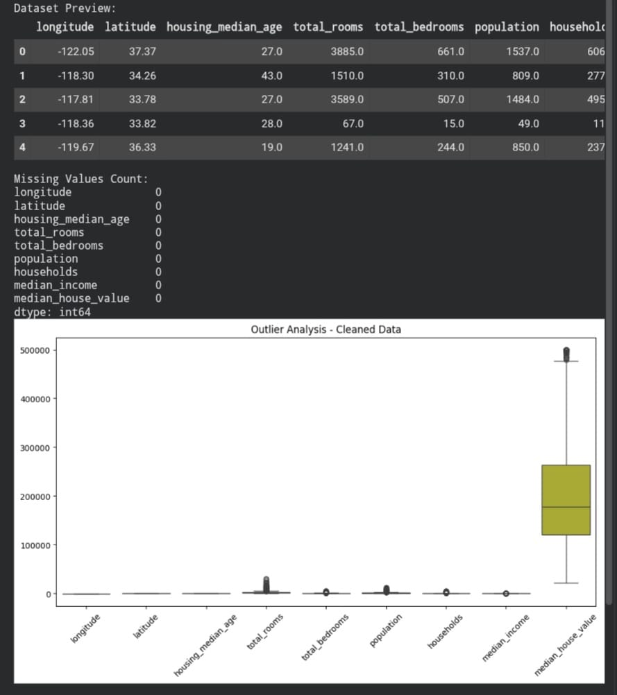

### Dashboard 2
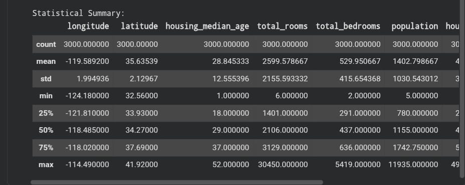

### Dashboard 3
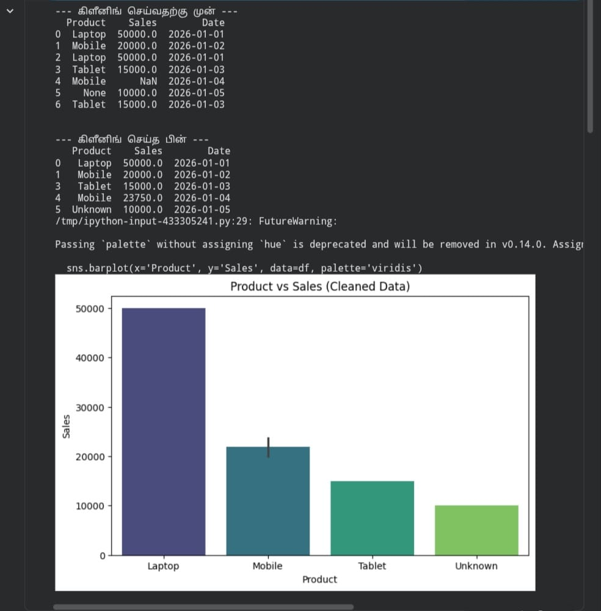

### Dashboard 4
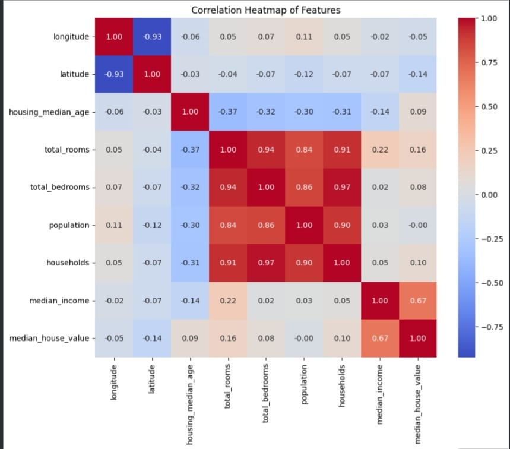

### Dashboard 5
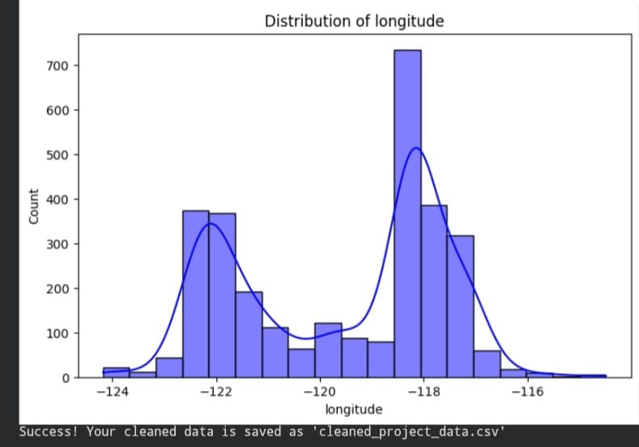

## Project 2: Exploratory Data Analysis (EDA)

### EDA 1
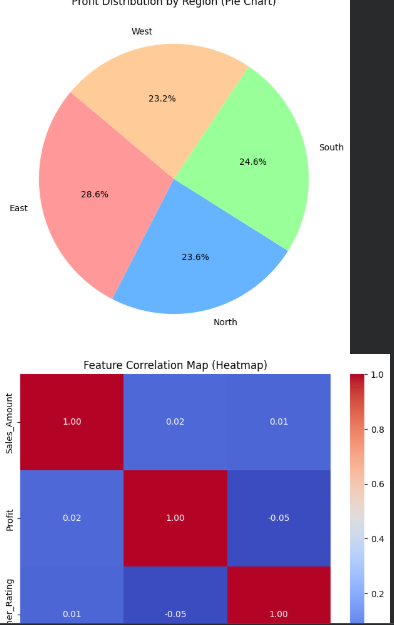

### EDA 2
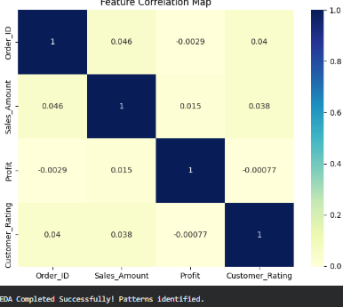

### EDA 3
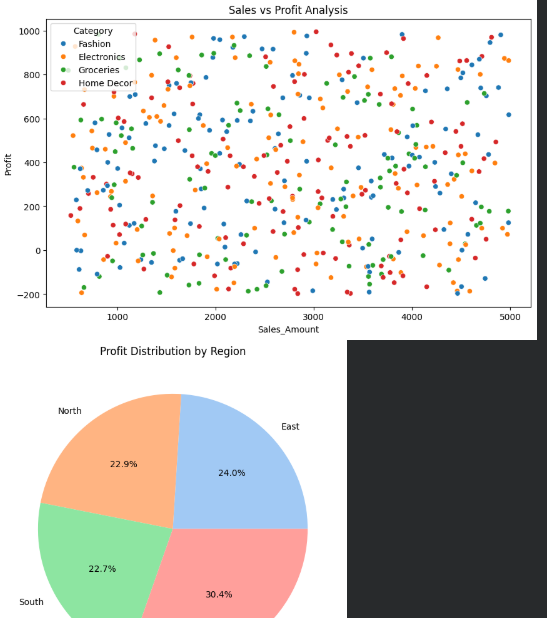

### EDA 4
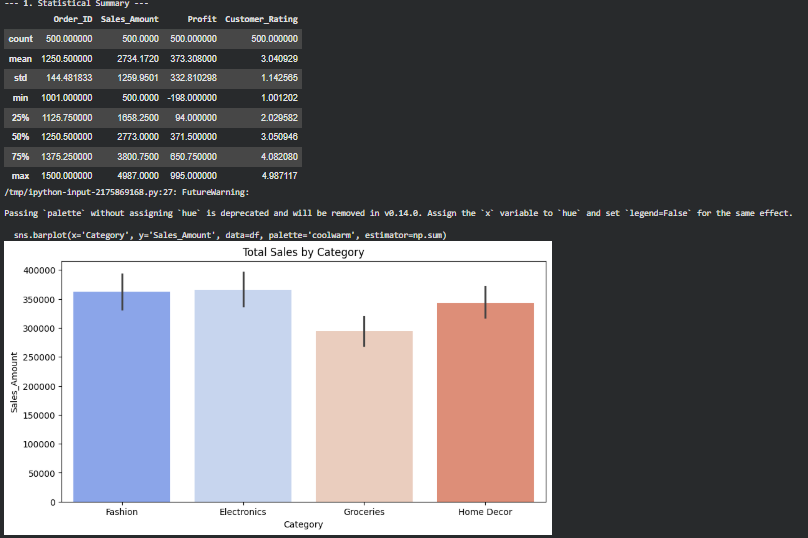

### EDA 5
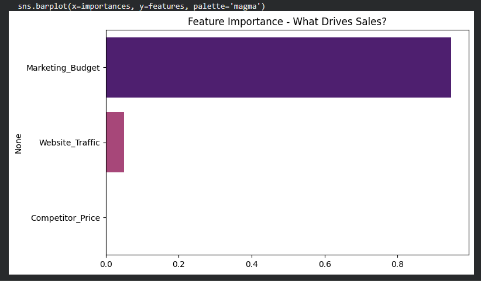

### EDA 6
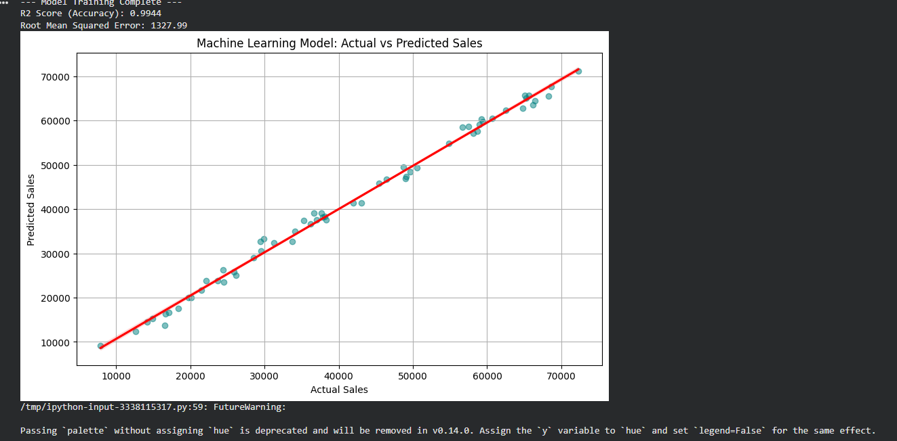
